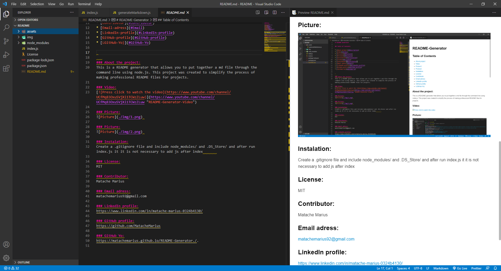

# Readme-Generator

## Table of Contents

* [About-project](#Description)
* [Video](#Video)
* [Picture1](#Picture1)
* [Picture2](#Picture2)
* [Instalation](#Instalation)
* [License](#License)
* [Contributor](#Contributor)
* [Email-adress](#Email)
* [LinkedIn-profile](#LinkedIn-profile)
* [GitHub-profile](#GitHub-profile)
* [LGitHub-Yo)](#GitHub-Yo)

   
### About the project:
This is a README generator that allows you to put together a md file through the command line using node.js. This project was created to simplify the process of making professional README files for projects.

### Video:

### Picture:
 

### Picture:
 

### Instalation:
Create a .gitignore file and include node_modules/ and .DS_Store/ and after run index.js it it is not necessary to add js after index       

### License:
MIT

### Contributor:
Matache Marius

### Email adress:
matachemarius92@gmail.com

### LinkedIn profile:
https://www.linkedin.com/in/matache-marius-0324b4130/

### GitHub profile:
https://github.com/MatacheMarius

### GitHub Yo:
https://matachemarius.github.io/Readme-Generator/.
